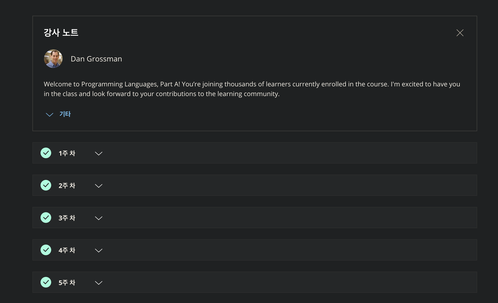

이번에 처음으로 완강한 코세라 강의다. Part a, b, c로 나뉘어져 있는데, a는 Standard ML, b는 Racket, c는 Ruby 언어를 사용하여 강의를 진행한다.

프로그래밍 언어론에 대해서 많이 알았고, 특히 함수형 언어의 구성요소에 대해 알 수 있던 수업이었다. 비록 사용하는 언어 그 자체에 대한 강의는 아니지만 말이다.

중간에 슬럼프가 와서 많이 쉬기도 했는데, 그래도 이렇게 다 하니까 기분이 좋다.

이제 동료 평가 점수만 기다리면 된다. [같이 해보실래요?](https://www.coursera.org/learn/programming-languages)