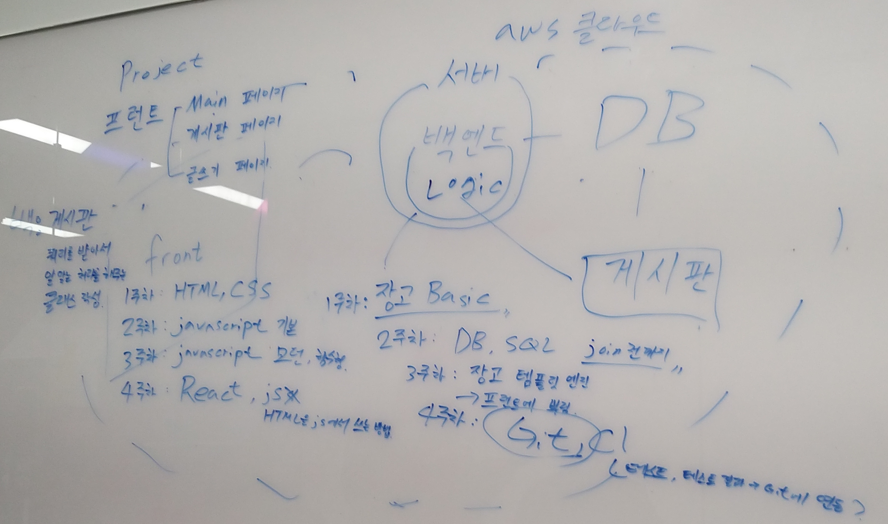

*먼 여정 시작(?)*

C크릿 쥬쥬라는 소모임을 가입했었는데, 웹 담당으로 내가 선정되어서 스터디를 같이 하게 되었다.

11월 11일 수요일에 같이 만나서 소개를 같이 하고, 6주동안 계획 구상을 하였다.

세 분은 메카트로닉스공학과를 다니면서 개발자를 준비한다고 하셨다. 프론트 한명에 백엔드 두명으로 이루어진 그룹이다. 나는 풀스택(?)

*6주 계획*

일단 프론트는 html/css/js 기본을 배운 뒤, 모던/함수형 js를 하고, 마지막으로 React를 배우기로 했다.

백엔드는 원래 node.js를 사용할 생각이었지만, 메카과에서 Python을 배우기 때문에 Python/Django와 관계형 DB로 기술스택을 채우기로 했다. ~~근데 장고에서는 DB를 직접 안다뤄도 되는데.. 알못이 또..~~

전체적인 계획은 4주동안 이론을 하고, 2주동안 포트폴리오가 될만한 프로젝트를 같이 하는것. 수요일 두시간밖에 만나지 못하니, 기본적인 학습은 집에서 해오기로 하고, 피드백과 실습 위주로 지도해주기로 했다.

그리고 밥을 같이 먹었다. 뼈해장국 국물이 달달하고 아주 좋더라~