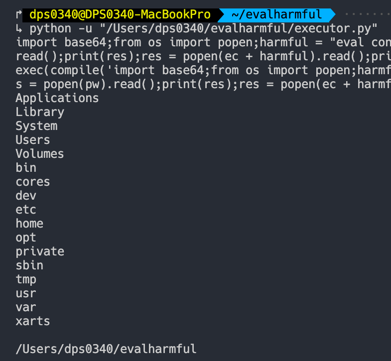
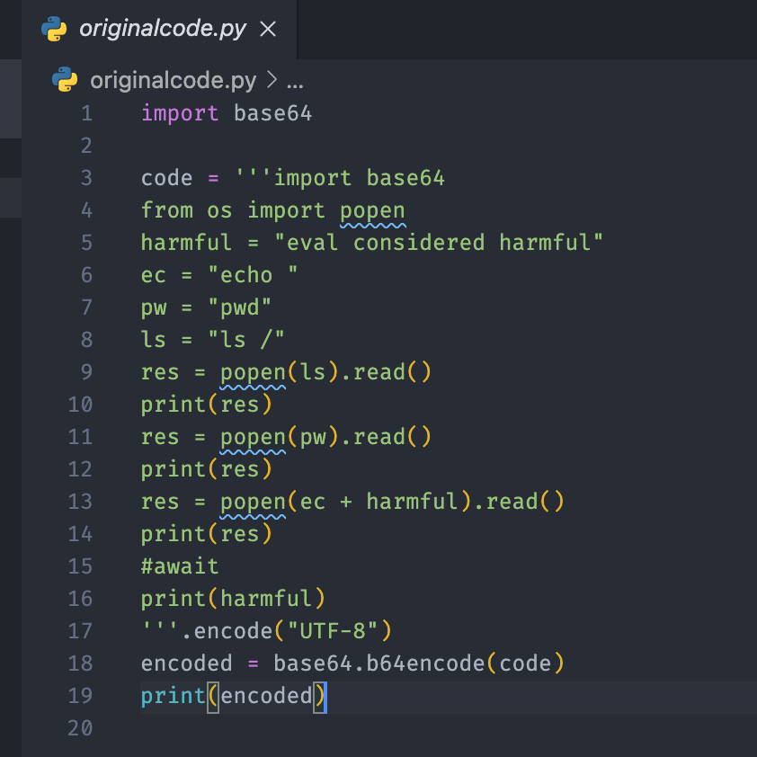

디스코드 봇 등에 eval, exec을 쓰는 봇들이 부쩍 늘어졌다.

안정적인 구현은 DSL을 하나 만드는 것이지만(본인은 Scheme 스타일을 선호) 파이썬 코드를 그대로 돌린다는것은 매력적이기 때문일 것이라고 생각한다.

나름 보안 기능이라고 eval, exec, base64 등의 함수/라이브러리를 실행하는것을 막아두는 경우가 있지만, 별로 효과는 없다.

이번 모의해킹에서는 실행기를 임의로 하나 작성했다.

그리고 실행기에 인자에 문자열 코드를 넣고, 안에 직접 구현한 base36을 써서 문자열을 난독화-복호화하고, ```vars(__builtins__)``` 딕셔너리를 사용하여 eval과 exec 함수를 변수값으로서 가져오는 코드를 짰다.

그 다음에 eval, exec을 탈취 한 뒤, base64 디코딩을 사용하여 저장된 코드를 실행하였다. 폰 노이만 구조(?)

실행 사진





옛말에 eval, exec은 사용하는 것이 아니라고 했는데, 옛말 중에 틀린 것이 없다.

소스 코드

[Github Gist](https://gist.github.com/DPS0340/ab141743362ab7f5fc7fa36a784a7db2) 에서 볼 수 있다.

코드가 좀 더러워서 추후에 리팩토링 할 예정이다.