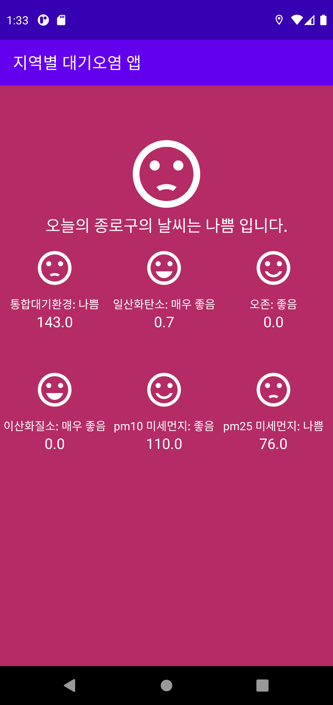
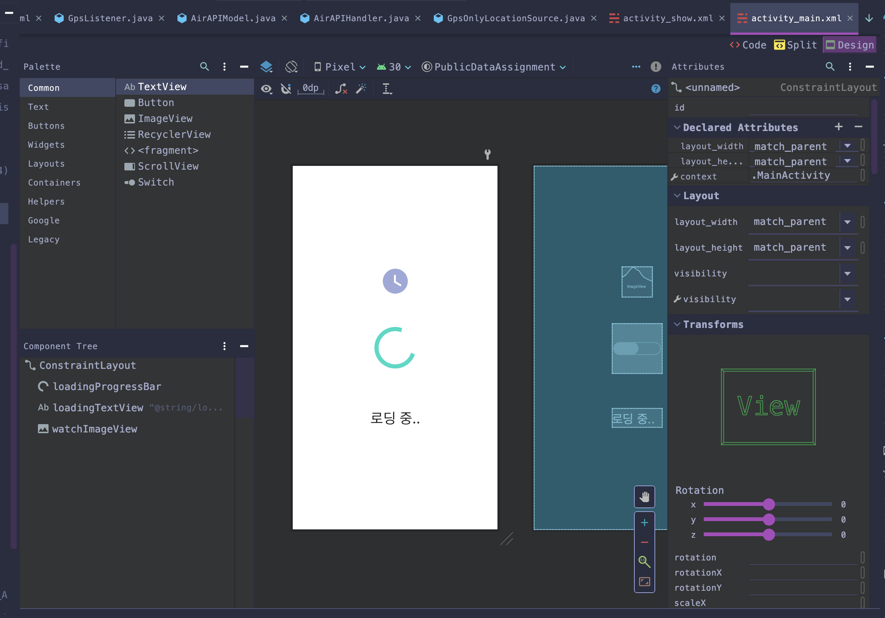
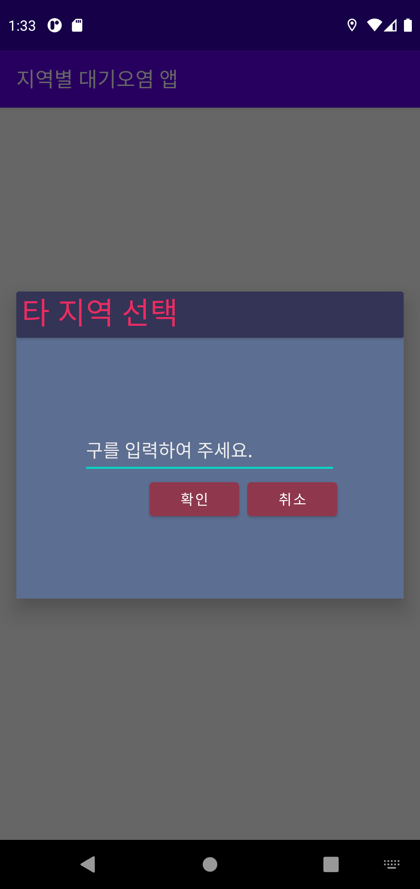

공공 API와 네이버 클라우드 API를 사용하여 현재 위치나 검색한 동의 대기 정보를 보여주는 앱을 외주 받아서 개발하였다.

클라이언트 측의 요구로 Java로 개발하였다.

기간 - 하루(2020년 11월 14일), Wakatime 기준 7시간 53분 소요.

설계

공공데이터 API의 xml 응답을 gson-xml 라이브러리를 사용하여 자바 클래스로 파싱해서 가져옴, 여기서 데이터를 나타내는 클래스는 모델이라는 패턴을 사용

네이버 클라우드 API를 사용하여 위도, 경도를 가져왔는데, 다른 네트워킹 스레드 없이 싱글 스레드를 사용하였다.(안티 패턴..)

위도 경도를 주소로 나타내는것은 Reverse Geocoding이라는 기술인데, 이것도 네이버 클라우드 API를 사용하였다.

대기오염 세부수치를 보여주는 UI는 ArrayList와 LayoutInflater를 사용하여 저장된 레이아웃을 동적으로 생성하여 LinearLayout에 바인딩.

후기

불친절한 네이버 클라우드 API 때문에 많이 애먹었다.

앱 디자인은 많이 귀찮다. 그렇지만 중요한 요소이다.

비고

당연하지만 외주니까 클로즈드 소스이다.

작동 화면

2020년 11월 16일 추가 내용

AsyncTask를 사용하여 논블로킹 네트워킹을 구현했다.

공공 데이터 요청 중에는 로딩 스크린이 뜨게 하였는데, 메인액티비티 로딩 xml을 재활용했다.