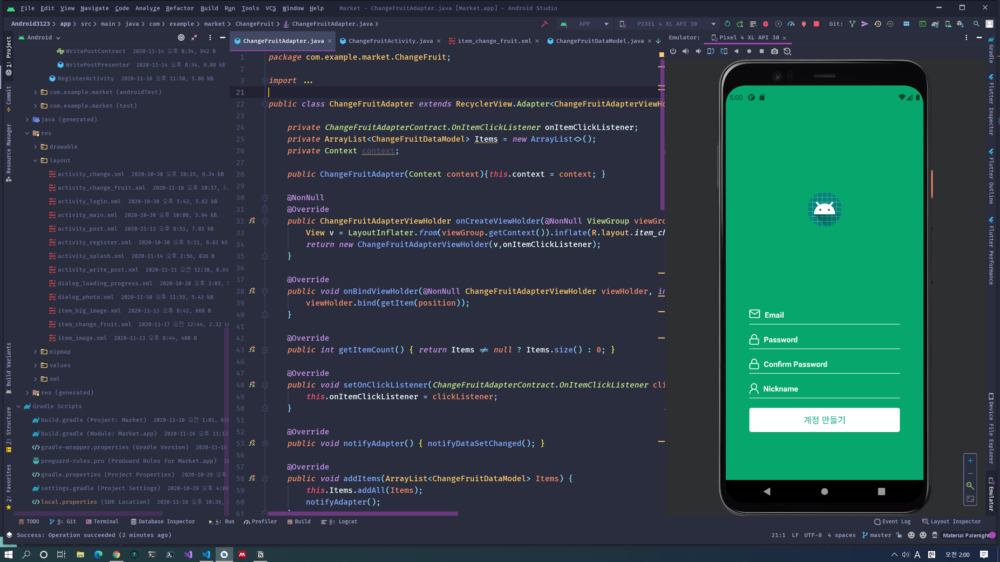

기본적인 코드베이스가 주어진 상태로, RecyclerView 코드를 작동되게 만들고 파이어베이스와 연동하는 역할을 맡았다.

Java 레거시 코드로 작업했으므로, Java를 개발 언어로 사용하였다,

RecyclerView 관련 지식이 없어서 많이 헤멨다. 파이어베이스도 자바로 다시 잡아보니 좀 난해했다.

기간 - 하루(2020년 11월 16일), Wakatime 기준 1시간 57분

비고

클라이언트분은 지역적인 커뮤니티에서 음식물들을 사고파는 서비스를 만들고자 했다.

클라이언트분의 성격이 좋으셔서 스트레스를 많이 받지 않고 한 것 같다.

클로즈드 소스이다.