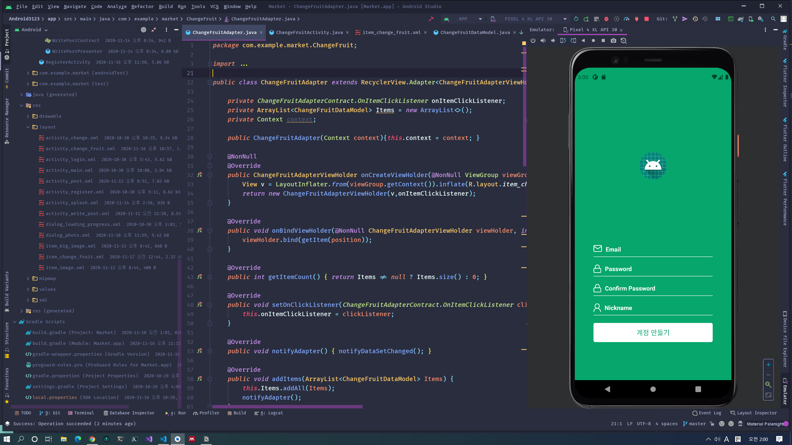

이번에는 다수의 이미지를 저장하고 글을 볼 때 받아와서, RecyclerView에서 클릭하면 여러개의 Bitmap 이미지가 Intent를 통해 넘어가도록 했다.

그리고 ViewPager를 통해 사진들을 스와이프하는 구현도 필요했는데, 이건 라이브러리를 써서 해결했다.

기본적인 리팩토링도 했는데, 쓸모없는 널체크 구문을 줄이고, ArrayList가 필요한 구문에서 쓰고, String을 통해 동적으로 id를 가져오게 하였다.

다수의 이미지를 보여주기 위해 xml 레이아웃도 살짝 고쳤다.